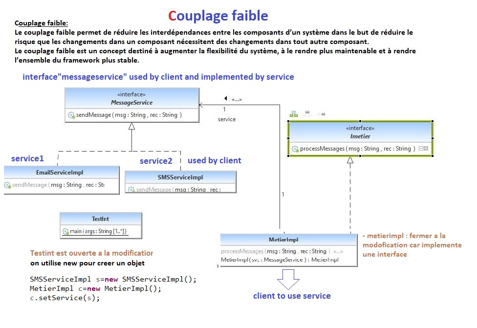
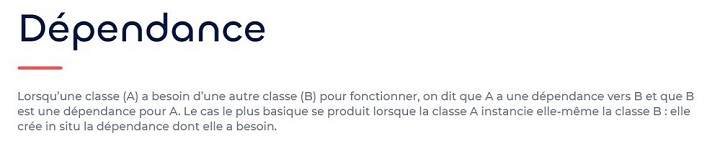
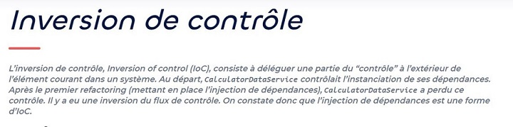

 

**Ces principes de programmation** sont la base de tout code qui se veut clair, propre, facilement maintenable et facile à faire évoluer. Lorsqu’on parle « facilité » de maintenance ou d’évolution à propos du code, il faut comprendre que cela signifie que le coût nécessaire pour effectuer un changement à l’application devrait toujours être inférieur aux bénéfices directement apportés par le changement. Je vous propose donc ici des outils pour vous aider à produire ce type de code.
 .

 

#la responsabilité unique

Pour faire au plus simple, il faut que votre ensemble de codes ne sache faire qu’une seule chose. A la base, on parle de ce principe pour une class en programmation orientée objet ( POO ) ; c’est à dire qu’une class ne doit s’occuper que d’une seule partie du code, ce dont pourquoi elle existe. 

###Open Closed Principle in Java###

Ce principe est décrit comme suit : les entités logicielles (classes, modules, fonctions, etc.) doivent être ouvertes à l'extension, mais fermées à la modification . Cela signifie qu'il devrait être possible de modifier le comportement externe d'une classe sans apporter de modifications au code existant de la classe. Selon ce principe, les classes sont conçues de sorte que modifier une classe pour l'adapter à des conditions spécifiques nécessite simplement de l'étendre et de remplacer certaines fonctions. Cela signifie que le système doit être flexible, capable de fonctionner dans des conditions changeantes sans changer le code source.

    
   
   
    

 <h1>Principe d'inversion de dépendance (DIP)</h1> 
     

 
 